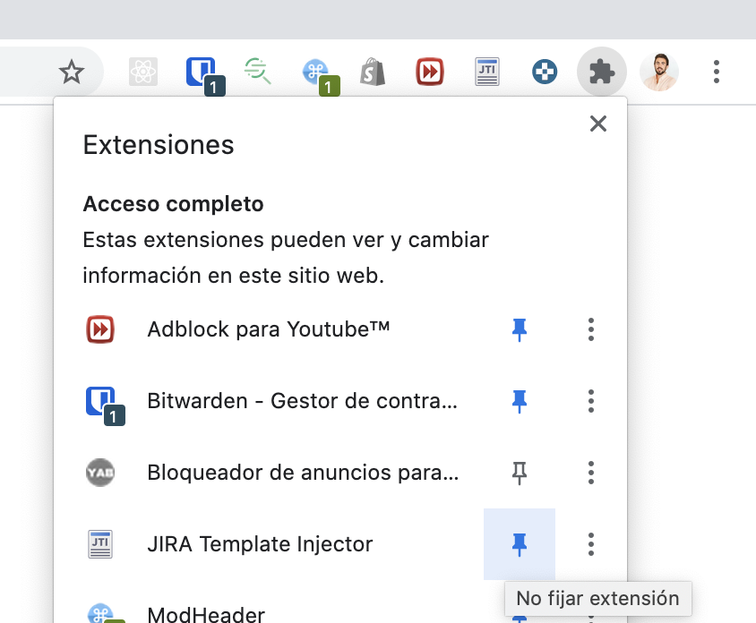
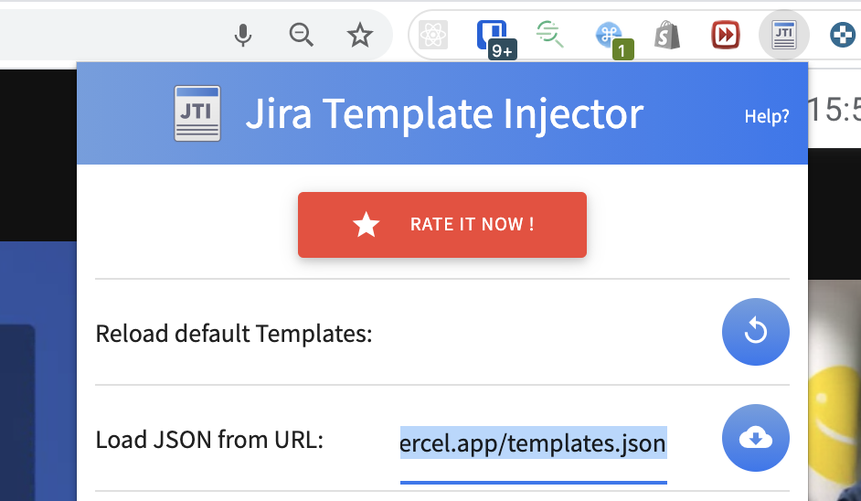
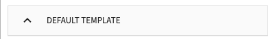

# Breaking Ads Random Tool

[Website](https://breakingads.vercel.app/)

# JIRA template

- Install the JIRA Template Injector: https://chrome.google.com/webstore/detail/jira-template-injector/hmhpegjieopgbdmpocdmfkafjgcdmhha
- If you don't see the JIRA Extension you will need to pin it:

- Open the extension and Add the URL: https://breakingads.vercel.app/templates.json into 'Load JSON from URL' input in the extension.

- Click the upload icon 
- (There is some wired bug in the Extension and sometimes you need this extra step): Click on one template, for example the Default Template:  and then Click on the Save button [./public/5.png](./public/5.png)
